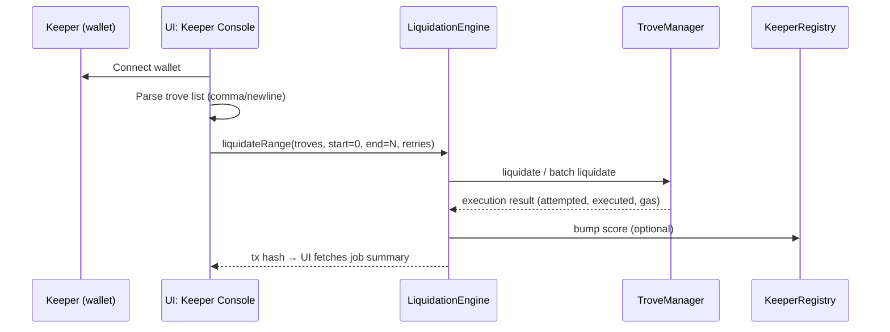

# TrovePilot Architecture

This document provides a high‑level view of the components and the two primary flows demonstrated in the hackathon UI.

## Components

```mermaid
flowchart LR
  subgraph UI[Next.js Dashboard]
    A[Automation Story]
    B[Keeper Console]
    C[Contracts Panel]
  end

  subgraph OnChain[Contracts (Mezo Testnet)]
    LE[LiquidationEngine]
    RR[RedemptionRouter]
    VM[VaultManager (MVP)]
    YA[YieldAggregator (stub)]
    KR[KeeperRegistry]
  end

  subgraph Mezo[Mezo Protocol]
    TM[TroveManager]
    ST[SortedTroves]
  end

  subgraph Oracles[Oracles]
    PY[Pyth]
    SK[Skip/Chainlink‑style]
  end

  UI -->|read/write| OnChain
  LE --> TM
  RR --> TM
  RR --> ST
  VM --> RR
  VM --> YA
  LE --> KR
  UI -->|read| Oracles
```

## Flow 1 — Keeper job (liquidateRange)



## Flow 2 — Redemption via VaultManager (MVP)

```mermaid
sequenceDiagram
  participant U as User
  participant VM as VaultManager
  participant RR as RedemptionRouter
  participant TM as TroveManager

  U->>VM: deposit MUSD, set config (musdPerRedeem, feeBps, active)
  U->>VM: execute(price) (keeper may relay)
  VM->>RR: redeemExact(...hints)
  RR->>TM: redeemCollateral
  TM-->>RR: redemption filled
  RR-->>VM: amounts
  VM-->>U: update internal balances; keeper fee
```

## Notes for reviewers

- UI supports both demo mode (simulated events) and live mode with on‑chain reads.
- Oracles are pluggable; Pyth is preferred when configured, Skip is used as fallback or standalone.
- `getRecentJobs` and a lightweight activity feed give quick feedback for the judges during testing.
