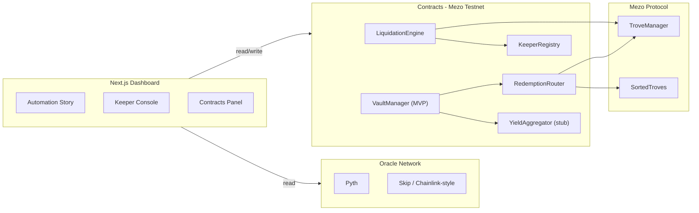
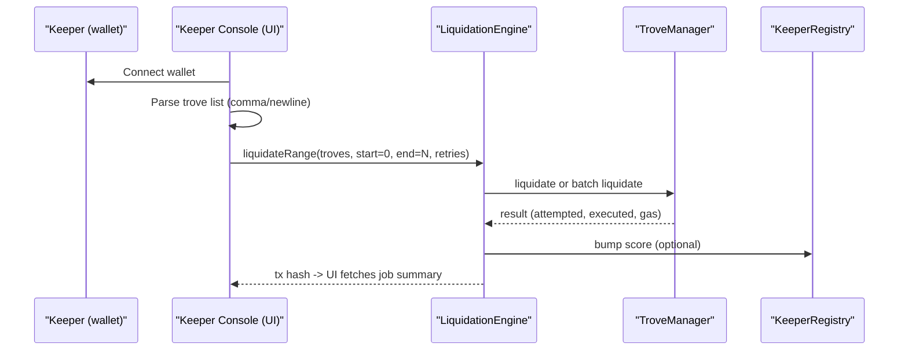
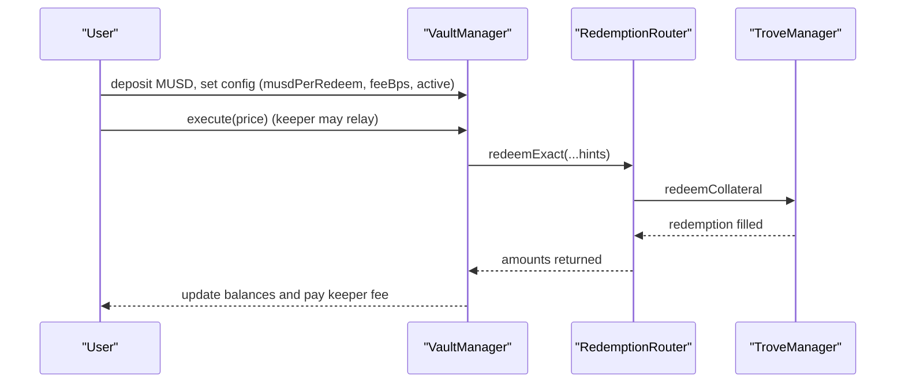

# TrovePilot Architecture

This document provides a high-level view of the components and the two primary flows demonstrated in the hackathon UI.

---

## Components

## Flow 1 - Keeper job (liquidateRange)

**Description**

- The keeper submits a liquidation batch through the UI.
- The LiquidationEngine executes best-effort liquidations, records results, and forwards rewards.
- The KeeperRegistry optionally updates the keeper's score and payout routing.
- The UI polls `getRecentJobs()` for visual feedback.

## Flow 2 - Redemption via VaultManager (MVP)

**Description**

- A user pre-funds VaultManager with MUSD and sets parameters.
- A keeper (or the user) calls `execute(price)` to trigger redemptions via RedemptionRouter.
- The router performs the redemption on Mezo's TroveManager, then returns results.
- The VaultManager settles balances internally and credits the keeper fee.

## Notes for reviewers

- The UI supports Demo Mode (scripted events) and Live Mode (on-chain reads/writes).
- Oracles are pluggable: Pyth is the primary feed when available; Skip acts as a fallback or standalone price source.
- `getRecentJobs` powers the activity feed and offers quick transparency during demos.
- All interactions are deterministic and replayable using the included Foundry scripts.

---

> TrovePilot is backend-first: contracts are reusable building blocks for Mezo-native automation.
> The dashboard simply demonstrates how keepers and users interact with those primitives.
