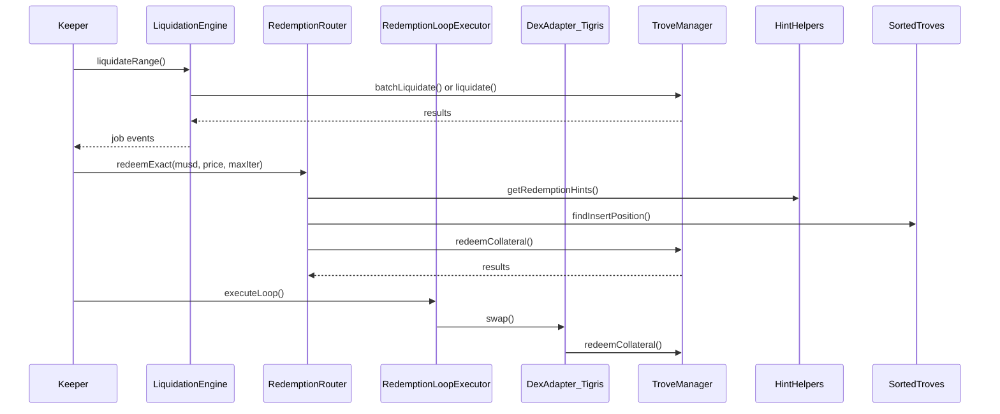
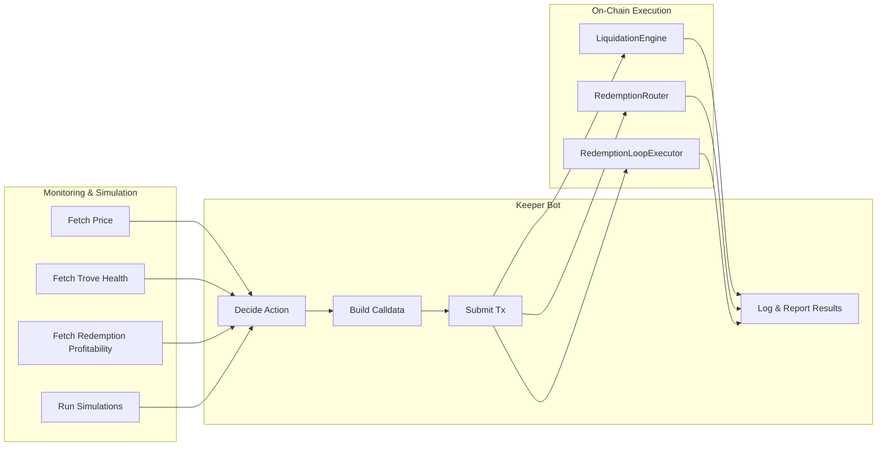

# TrovePilot v2 — Architecture Overview

## 1. Design Philosophy & Principles

TrovePilot v2 is built around a few core principles:

- **Thin on-chain, rich off-chain.**  
  Contracts are minimal execution primitives. All logic, strategy, simulation, and monitoring run off-chain.

- **Permissionless & composable.**  
  No keeper permissions, no staking, no governance — anyone can call.

- **Stateless or minimal-state contracts.**  
  Easier to audit, less risk, less surface area.  

- **Transparency & audibility.**  
  Off-chain tools rely heavily on emitted events.

- **No protocol-level capital or governance.**  
  No protocol capital, no peg-defense, no marketplace, no tokenomics.

This matches Mezo’s philosophy and avoids overlap with SafetyBuffer.

---

## 2. System Layers

┌───────────────────────────────────┐
│ Off-Chain Keeper Ecosystem        │
│  (bots, SDK, monitoring)          │
└───────────────────┬───────────────┘
                    │  calldata / RPC
┌───────────────────▼───────────────┐
│ On-Chain Execution Primitives     │
│  (stateless wrappers)             │
└───────────────────┬───────────────┘
                    ▼
  TroveManager + Mezo Core (liq/redemption)


### 2.1 On-Chain Execution Primitives (TrovePilot Contracts)

| Contract | Responsibility |
|---------|----------------|
| **LiquidationEngine** | Batch or per-trove liquidation wrapper — executes liquidation of under-collateralized troves. Emits job events for external tracking. |
| **RedemptionRouter**  | Simplifies redemption flows. Exposes both “quick” (no hints) and “hinted” redemption for gas-efficient calls. |
| **RedemptionLoopExecutor** | Executes redemption-loop workflows: swap → redeem → optional rebalance. Enables arbitrage/redemption-loop strategies leveraging liquidity (e.g., via Tigris). |
| **DexAdapter_Tigris** (and future adapter slots) | Minimal wrapper over external DEX / AMM (currently Tigris), for swap operations invoked by bots or loops. |

**Characteristics:**
- No custody of user funds.  
- No staking, governance, or tokenomics.  
- Permissionless (anyone can call).  
- Stateless or minimal state (only job logs, if any).  
- Full transparency to allow off-chain automation and monitoring.

### 2.2 Off-Chain Keeper Ecosystem

This layer encompasses:
- Keeper bots (liquidation bot; redemption-loop bot; monitoring bot)  
- SDK for building bots or custom tooling (`@trovepilot/sdk`)  
- Scripts for monitoring, alerting, and profitability simulation  
- Optional dashboard / UI for analytics and manual job triggering  

All business logic lives here — decisions, arbitrage strategy, slippage modelling, profitability checks. On-chain primitives are only used to *execute* once off-chain logic decides.

---

## 3. Excluded Functionality & What TrovePilot v2 Does *Not* Do

TrovePilot v2 deliberately avoids several responsibilities to remain minimal, safe, and aligned:

- No protocol-owned capital management  
- No peg-defense logic (handled by Mezo’s SafetyBuffer)  
- No vaults, yield aggregation, or tokenomics  
- No on-chain automation logic (jobs, scheduling, staking, reputation)  
- No custody of user funds  
- No keeper marketplace, credit system, or multi-party coordination on-chain  

TrovePilot is **only** an execution & tooling layer.

---

## 4. Extensibility & Future-Proofing

While v2 is minimal, the architecture allows **safe, incremental extensions**, should demand arise and community contribution grow:
- Additional DEX / AMM adapters (Uniswap, Curve, etc.), by replicating `DexAdapter_` pattern.  
- More on-chain wrappers for future Mezo flows (e.g., batched redemptions, liquidation incentives) — provided they do not introduce protocol-level logic.  
- Off-chain automation ecosystem expansion — multiple bots, dashboards, integrations, monitoring tools.  
- Modular design: off-chain and on-chain are decoupled — you can swap or upgrade bots without touching contracts.

---

## 5. Security & Audit Considerations

- **Minimal code surface.** Less logic on-chain → smaller audit surface → easier to reason about correctness.  
- **Stateless or minimal-state design.** Reduces risk of complex storage bugs.  
- **Composability & modularity.** Off-chain logic can be audited separately from on-chain execution.  
- **Clear event logging.** All actions emit structured events, making it easy to reconstruct what happened, essential for off-chain monitoring and forensic analysis.  

These practices match widely recommended DeFi security best-practices: simplicity, composability, clear separation of concerns, modularity.

---

## 6. Developer Workflow & Integration Flow

1. Off-chain bot computes profitable action (e.g., redemption loop, liquidation target list).  
2. Bot encodes calldata with safe parameters (slippage, profit threshold, limits).  
3. Bot sends transaction to on-chain primitive (LiquidationEngine / RedemptionRouter / RedemptionLoopExecutor).  
4. Contract executes, emits structured events.  
5. Bot monitors events, logs outcome, optionally triggers post-actions (rebalance, alerting, reporting).  

This separation allows maximum flexibility, safety, and community contribution without risking protocol integrity.


---

## 7. Mermaid Diagrams

### 7.1. High-Level Architecture

```mermaid
flowchart TD

    subgraph OffChain["Off-Chain Keeper Ecosystem"]
        K1[Keeper Bots\n(liquidation, redemption, loops)]
        K2[Monitoring & Alerts]
        SDK[TrovePilot SDK\n(JS/TS)]
    end

    subgraph OnChain["On-Chain Execution Primitives"]
        LE[LiquidationEngine]
        RR[RedemptionRouter]
        RL[RedemptionLoopExecutor]
        DA[DexAdapter_Tigris]
    end

    subgraph MezoCore["Mezo Protocol"]
        TM[TroveManager]
        SH[HintHelpers]
        ST[SortedTroves]
        TP[Price Feed / Oracle]
    end

    K1 -->|calldata / RPC| LE
    K1 --> RR
    K1 --> RL

    LE --> TM
    RR --> TM
    RR --> SH
    RR --> ST
    RL --> DA
    RL --> RR
    DA -->|swap| TM

    K2 <-->|events| LE
    K2 <-->|events| RR
    K2 <-->|events| RL
```

### 7.2. On-Chain Execution Flow



### 7.3. Off-Chain Keeper Workflow



---

### 8. ASCII Diagrams

**High-Level Architecture**

 Off-Chain Layer
 ┌──────────────────────────────────────────────┐
 │ Keeper Bots  |  Monitoring  |  SDK           │
 └──────────────┬───────────────────────────────┘
                │ RPC calls / calldata
 On-Chain Layer │
 ┌──────────────▼───────────────────────────────┐
 │ LiquidationEngine                            │
 │ RedemptionRouter                             │
 │ RedemptionLoopExecutor                       │
 │ DexAdapter_Tigris                            │
 └──────────────┬───────────────────────────────┘
                ▼
        Mezo Core Protocol
    (TroveManager, HintHelpers, SortedTroves)


**Keeper Workflow**

Monitor Price → Monitor Troves → Simulate → Decide Action
          ↓                          ↓
     Build calldata → Submit tx → Contract executes → Emit events → Log results

